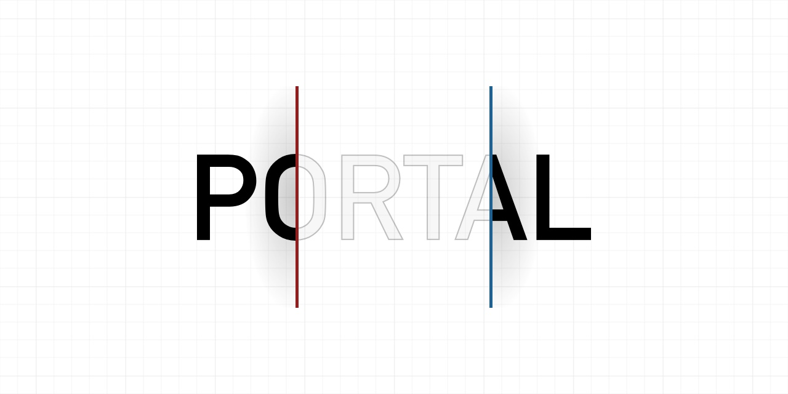

# React Native Portal

[](https://www.npmjs.com/package/@gorhom/portal) [](https://www.npmjs.com/package/@gorhom/portal) [](https://www.npmjs.com/package/@gorhom/portal) [](https://snack.expo.io/@gorhom/portal-example)

A simplified portal implementation for ⭕️ React Native ⭕️.



---

## Features

- Multi portals handling.
- Multi portal hosts handling.
- Allow override functionality.
- Compatible with `React Native Web`.
- Compatible with `Expo`, [check out the project Expo Snack](https://snack.expo.io/@gorhom/portal-example).
- Written in `TypeScript`.

## Installation

```sh
yarn add @gorhom/portal
```

## Usage

### Simple Portal

This is the very simple usage of this library, where you will teleport your content to the `PortalProvider` layer of the app.

First, you will need to add `PortalProvider` to your root component - this usually be the `App.tsx`.

```tsx
export const App = () => (
  <PortalProvider>
  {... your app goes here}
  </PortalProvider>
);
```

Last, you wrap the content that you want to teleport with `Portal`.

```tsx
const BasicScreen = () => {
  return (
    { ... }
    <Portal>
      <Text>
        Text to be teleported to the root host
      </Text>
    </Portal>
    { ... }
  );
};
```

### Custom Portal Host

This is when you need to teleport your content to a custom portal host `PortalHost` at any layer in the app.

First, you will need to add `PortalProvider` to your root component - this usually be the `App.tsx`.

```tsx
export const App = () => (
  <PortalProvider>
  {... your app goes here ...}
  </PortalProvider>
);
```

Second, you will need to add `PortalHost` at any layer in your app, with a custom name.

```tsx
const CustomView = () => {
  return (
    { ... }
    <PortalHost name="CustomPortalHost" />
    { ... }
  );
};
```

Last, you wrap the content that you want to teleport with `Portal` and the custom portal host name.

```tsx
const BasicScreen = () => {
  return (
    { ... }
    <Portal hostName="CustomPortalHost">
      <Text>
        Text to be teleported to the CustomView component
      </Text>
    </Portal>
    { ... }
  );
};
```

### React Native Screens integration

In order to get your teleported content on top of all native views, you will need to wrap your content with `FullWindowOverlay` from `react-native-screens`.

```tsx
import { FullWindowOverlay } from 'react-native-screens';

const BasicScreen = () => {
  return (
    { ... }
    <Portal>
      <FullWindowOverlay style={StyleSheet.absoluteFill}>
        <Text>
          Text to be teleported to the CustomView component
        </Text>
      </FullWindowOverlay>
    </Portal>
    { ... }
  );
};
```
### React Native Gesture Handler

To avoid issues when using the React Native Portal with React Native Gesture Handler, you must place the `PortalProvider` under the `GestureHandlerRootView`, otherwise it might freeze your app.

```tsx
export const App = () => (
  <GestureHandlerRootView>
    <PortalProvider>
    {... your app goes here}
    </PortalProvider>
  </GestureHandlerRootView>
);
```

> Read more about the [app freezing issue](https://github.com/gorhom/react-native-portal/issues/24).

## Props

### Portal Props

#### `name`

Portal's key or name to be used as an identifer.

> `required:` NO | `type:` string | `default:` auto generated unique key

#### `hostName`

Host's key or name to teleport the portal content to.

> `required:` NO | `type:` string | `default:` 'root'

#### `handleOnMount`

Override internal mounting functionality, this is useful if you want to trigger any action before mounting the portal content.

```ts
type handleOnMount = (mount?: () => void) => void;
```

> `required:` NO | `type:` function | `default:` undefined

#### `handleOnUnmount`

Override internal un-mounting functionality, this is useful if you want to trigger any action before un-mounting the portal content.

```ts
type handleOnUnmount = (unmount?: () => void) => void;
```

> `required:` NO | `type:` function | `default:` undefined

#### `children`

Portal's content.

> `required:` NO | `type:` ReactNode | ReactNode[] | `default:` undefined

### PortalHost Props

#### `name`

Host's key or name to be used as an identifier.

> `required:` YES | `type:` string

## Hooks

### `usePortal`

To access internal functionalities of all portals.

```ts
/**
 * @param hostName host name or key.
 */
type usePortal = (hostName: string = 'root') => {
  /**
   * Register a new host.
   */
  registerHost: () => void;
  /**
   * Deregister a host.
   */
  deregisterHost: () => void;
  /**
   * Add portal to the host container.
   * @param name portal name or key
   * @param node portal content
   */
  addPortal: (name: string, node: ReactNode) => void;
  /**
   * Update portal content.
   * @param name portal name or key
   * @param node portal content
   */
  updatePortal: (name: string, node: ReactNode) => void;
  /**
   * Remove portal from host container.
   * @param name portal name or key
   */
  removePortal: (name: string) => void;
};
```

<h2 id="built-with">Built With ❤️</h2>

- [@react-native-community/bob](https://github.com/react-native-community/bob)

## Author

- [Mo Gorhom](https://gorhom.dev/)

## Sponsor & Support

To keep this library maintained and up-to-date please consider [sponsoring it on GitHub](https://github.com/sponsors/gorhom). Or if you are looking for a private support or help in customizing the experience, then reach out to me on Twitter [@gorhom](https://twitter.com/gorhom).

## License

[MIT](./LICENSE)

---

<p align="center">
  <a href="https://gorhom.dev/#gh-light-mode-only" target="_blank">
    
  </a>
  <a href="https://gorhom.dev/#gh-dark-mode-only" target="_blank">
    
  </a>
</p>
